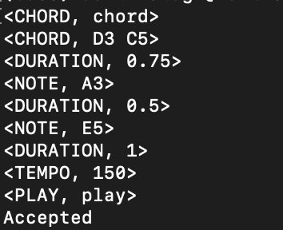

# MusicLang Lexical Grammar

## Overview
MusicLang is a programming language designed for composing music through code. This document outlines the lexical grammar defining the token types used in MusicLang.

## Token Types

### 1. Note
- **Description**: Represents individual musical notes, which can be specified with their pitch and octave.
- **Examples**: 
    - C4 : Middle C
    - D#5 : D sharp in the fifth octave
    - E3 : E in the third octave
- **Pattern**: A-G(#[0-9]+|b[0-9]*)?[0-9]

### 2. Chord
- **Description**: Represents multiple notes played together simultaneously.
- **Examples**: 
    - chord (C4 D4) : C and D played together
    - chord (A3 C5 E5) : A, C, and E played simultaneously
- **Pattern**: chord (A-G(#[0-9]+|b[0-9]\*)?[0-9]+)(?: (A-G(#[0-9]+|b[0-9]*)?[0-9]+))+

### 3. Duration
- **Description**: Represents the length of time a note or chord is played, often specified in beats or fractions of a beat.
- **Examples**: 
    - 1.0 (one whole beat)
    - 0.5 (half a beat)
    - 0.75 (three-quarters of a beat)
- **Pattern**: (1|0\.[0-9]+|0?[1-9])

### 4. Tempo
- **Description**: Represents the speed of the music, commonly defined in beats per minute (BPM). Tempo affects the overall pace of the composition.
- **Examples**: 
    - 1.5 (indicating the tempo for a section)
    - 120 (120 BPM)
    - 90 (90 BPM)
- **Pattern**: ([0-9]+(\.[0-9]+)?)

### 5. Play
- **Description**: Represents the action of playing a note or chord.
- **Examples**: play
- **Pattern**: play

### 6. Share
- **Description**: Represents the action of sharing a musical composition or code.
- **Examples**: share
- **Pattern**: share

### 7. Save
- **Description**: Represents saving the composition.
- **Examples**: save
- **Pattern**: save

## Valid Token Sequences
Note the following key valid token sequences:
- A note must be followed by a duration.
- A chord must be followed by a duration.
- Each sequence must terminate with a tempo.
- The sequence may include multiple notes and durations, but must always adhere to the following rules:
    - Valid sequences:
        - C4 0.5 D3 1 120
        - (C4 D3) 0.5 120
    - Invalid sequences:
        - C4 : ends on a note without a duration or tempo
        - C4 0.5 : doesn't define a tempo

## State Transitions
Note the following DFA diagram that illustrates the state transitions for this scanner:

- **S0 : START** Initial state before any tokens are read.
- **S1 : READING_NOTE** Read a valid note, expecting corresponding duration.
- **S2 : READING_DURATION** Read a duration. Can transition to **S1, S3, S4** based on subsequent token.
- **S3 : READING_CHORD** Read a valid chord, awaiting chord notes or duration.
- **S4 : ACCEPT** Valid sequence of tokens.
- **Serr: REJECT** Invalid sequence of tokens.

### Example State Transition 
Take the following working example : **chord (D3 C5) 0.75 A3 0.5 E5 1 150 play**

 1. START --> S0
 2. Read the token: **chord**  
    State: **S3**
 3. Read the token: **(**  
    Expecting notes in the chord, so we stay in this state.
    State: **S3** 
 4. Read the token: **D3**  
    State: **S3**
 5. Read the token: **C5**  
    State: **S3**
 6. Read the token: **)**  
    Chord reading is complete; now expecting a duration.
    State: **S3**
 7. Read the token: **0.75**  
    State: **S2**
 8. Read the token: **A3**  
    State: **S1**
 9. Read the token: **0.5**  
    State: **S2**
 10. Read the token: **E5**   
    State: **S1**
 11. Read the token: **1**  
    State: **S2**
 12. Read the token: **150**  
    State: **S4**
 13. Read the token: **play**  
     State: **S4**  

Scanner ends in the accepting state **S4** which means all tokens are valid, so input is **accepted**.

#### Sample Scanner Output:

